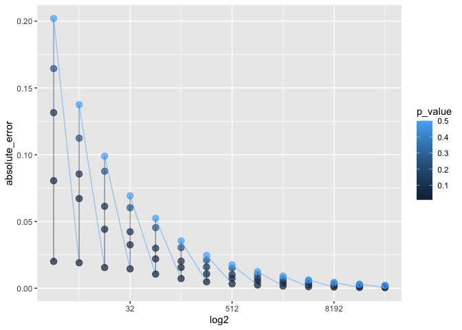
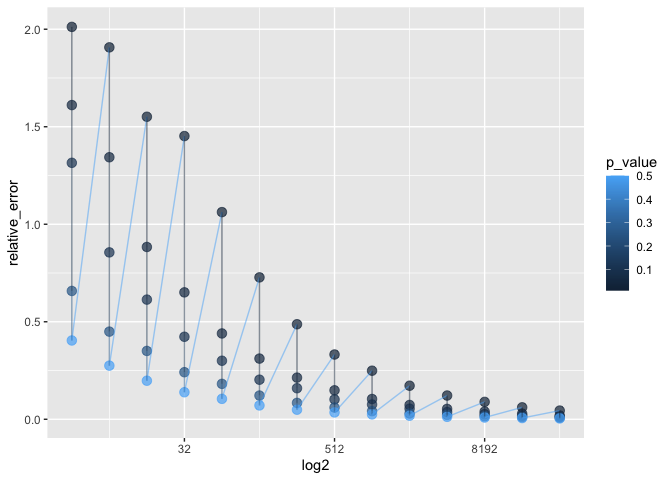

monte-carlo-yuting
================

``` r
library(dplyr)
```

    ## 
    ## Attaching package: 'dplyr'

    ## The following objects are masked from 'package:stats':
    ## 
    ##     filter, lag

    ## The following objects are masked from 'package:base':
    ## 
    ##     intersect, setdiff, setequal, union

``` r
library(tidyverse)
```

    ## ── Attaching packages ─────────────────────────────────────── tidyverse 1.3.1 ──

    ## ✓ ggplot2 3.3.5     ✓ purrr   0.3.4
    ## ✓ tibble  3.1.3     ✓ stringr 1.4.0
    ## ✓ tidyr   1.1.3     ✓ forcats 0.5.1
    ## ✓ readr   2.0.1

    ## ── Conflicts ────────────────────────────────────────── tidyverse_conflicts() ──
    ## x dplyr::filter() masks stats::filter()
    ## x dplyr::lag()    masks stats::lag()

``` r
library(ggplot2)
```

``` r
  n = 1000
  absolute_error <- c()
  relative_error <- c()
  w <- c()
  log2 <- c()
  sum <- c()
  
  
  # Create row names
  p_value <- c(0.01, 0.05, 0.10, 0.25, 0.50)
  
  # Create column names
  a <- 2
  i <- seq(1, 14, 1)
  col <- a*2^i
  
  #p <- rep(NA, times = 14)
  #sum <- cbind(sum_absolute, p)
  
  for(q in 1:length(p_value)){
    for(p in 1:14){
      prob_hat <- rbinom(n, col[p], p_value[q]) / col[p]
      abe <- mean(abs(prob_hat - p_value[q]))
      ree <- mean((abs(prob_hat - p_value[q]) / p_value[q]))
      absolute_error <- append(absolute_error, abe)
      relative_error <- append(relative_error, ree)
      log2 <- append(log2, col[p])
      w <- append(w, p_value[q])
    }
    sum$log2 <- c(log2)
    sum$p_value <- c(w)
    sum$absolute_error <- c(absolute_error)
    sum$relative_error <- c(relative_error)
  }


  (sum <- data.frame(sum))
```

    ##     log2 p_value absolute_error relative_error
    ## 1      4    0.01   0.0201200000    2.012000000
    ## 2      8    0.01   0.0190700000    1.907000000
    ## 3     16    0.01   0.0155125000    1.551250000
    ## 4     32    0.01   0.0145225000    1.452250000
    ## 5     64    0.01   0.0106218750    1.062187500
    ## 6    128    0.01   0.0072756250    0.727562500
    ## 7    256    0.01   0.0048720312    0.487203125
    ## 8    512    0.01   0.0033208594    0.332085937
    ## 9   1024    0.01   0.0024908984    0.249089844
    ## 10  2048    0.01   0.0017210547    0.172105469
    ## 11  4096    0.01   0.0012175879    0.121758789
    ## 12  8192    0.01   0.0008911377    0.089113770
    ## 13 16384    0.01   0.0006120996    0.061209961
    ## 14 32768    0.01   0.0004455603    0.044556030
    ## 15     4    0.05   0.0805500000    1.611000000
    ## 16     8    0.05   0.0671750000    1.343500000
    ## 17    16    0.05   0.0441750000    0.883500000
    ## 18    32    0.05   0.0325375000    0.650750000
    ## 19    64    0.05   0.0220000000    0.440000000
    ## 20   128    0.05   0.0155609375    0.311218750
    ## 21   256    0.05   0.0106789063    0.213578125
    ## 22   512    0.05   0.0074210937    0.148421875
    ## 23  1024    0.05   0.0052029297    0.104058594
    ## 24  2048    0.05   0.0036610352    0.073220703
    ## 25  4096    0.05   0.0026646973    0.053293945
    ## 26  8192    0.05   0.0019740234    0.039480469
    ## 27 16384    0.05   0.0014370361    0.028740723
    ## 28 32768    0.05   0.0009555603    0.019111206
    ## 29     4    0.10   0.1315000000    1.315000000
    ## 30     8    0.10   0.0855750000    0.855750000
    ## 31    16    0.10   0.0613625000    0.613625000
    ## 32    32    0.10   0.0423062500    0.423062500
    ## 33    64    0.10   0.0300125000    0.300125000
    ## 34   128    0.10   0.0202937500    0.202937500
    ## 35   256    0.10   0.0159226563    0.159226563
    ## 36   512    0.10   0.0101820312    0.101820312
    ## 37  1024    0.10   0.0075802734    0.075802734
    ## 38  2048    0.10   0.0054217773    0.054217773
    ## 39  4096    0.10   0.0036944824    0.036944824
    ## 40  8192    0.10   0.0026584229    0.026584229
    ## 41 16384    0.10   0.0018717651    0.018717651
    ## 42 32768    0.10   0.0012796326    0.012796326
    ## 43     4    0.25   0.1645000000    0.658000000
    ## 44     8    0.25   0.1123750000    0.449500000
    ## 45    16    0.25   0.0876250000    0.350500000
    ## 46    32    0.25   0.0603437500    0.241375000
    ## 47    64    0.25   0.0454062500    0.181625000
    ## 48   128    0.25   0.0303984375    0.121593750
    ## 49   256    0.25   0.0210312500    0.084125000
    ## 50   512    0.25   0.0150605469    0.060242188
    ## 51  1024    0.25   0.0104208984    0.041683594
    ## 52  2048    0.25   0.0074223633    0.029689453
    ## 53  4096    0.25   0.0056057129    0.022422852
    ## 54  8192    0.25   0.0038834229    0.015533691
    ## 55 16384    0.25   0.0027874756    0.011149902
    ## 56 32768    0.25   0.0019801636    0.007920654
    ## 57     4    0.50   0.2020000000    0.404000000
    ## 58     8    0.50   0.1375000000    0.275000000
    ## 59    16    0.50   0.0988750000    0.197750000
    ## 60    32    0.50   0.0692812500    0.138562500
    ## 61    64    0.50   0.0523750000    0.104750000
    ## 62   128    0.50   0.0354921875    0.070984375
    ## 63   256    0.50   0.0245625000    0.049125000
    ## 64   512    0.50   0.0175195313    0.035039063
    ## 65  1024    0.50   0.0124257813    0.024851563
    ## 66  2048    0.50   0.0091523437    0.018304687
    ## 67  4096    0.50   0.0062702637    0.012540527
    ## 68  8192    0.50   0.0044654541    0.008930908
    ## 69 16384    0.50   0.0031255493    0.006251099
    ## 70 32768    0.50   0.0021431580    0.004286316

``` r
ab <- ggplot(sum, aes(x = log2, y = absolute_error))
ab + geom_point(aes(colour = p_value), size = 3, alpha = 0.7) +
  geom_line(aes(colour = p_value), alpha = 0.5) +
  scale_x_continuous(trans = "log2")
```

<!-- -->

``` r
re <- ggplot(sum, aes(x = log2, y = relative_error))
re + geom_point(aes(colour = p_value), size = 3, alpha = 0.7) +
  geom_line(aes(colour = p_value), alpha = 0.5) +
  scale_x_continuous(trans = "log2")
```

<!-- -->
